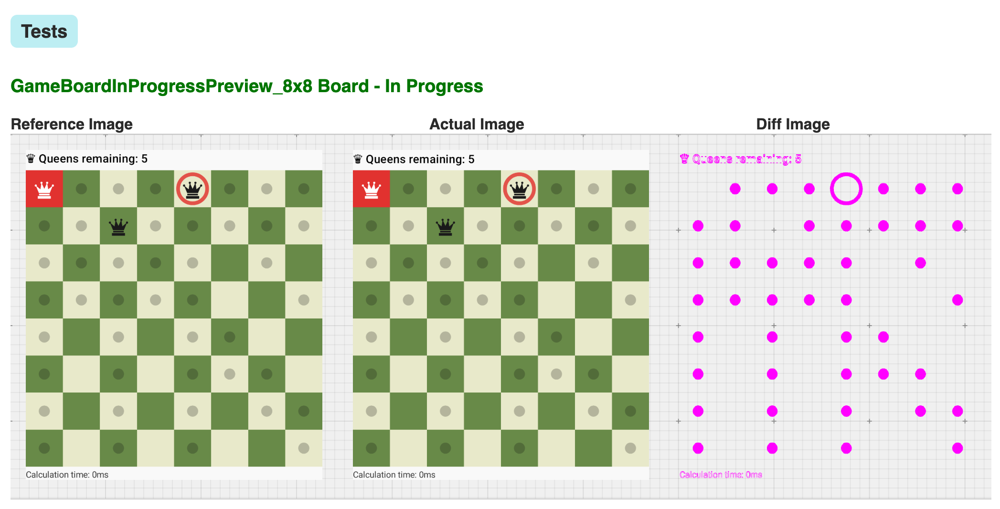

# N-Queens Puzzle

An Android puzzle game based on the classic [N-Queens problem](https://en.wikipedia.org/wiki/Eight_queens_puzzle). Place n queens on an n×n chessboard so that no two queens threaten each other (same row, column, or diagonal).

## Demo

N-Queens Puzzle Demo video: [Download](https://github.com/monday8am/nqweenspuzzle/blob/main/assets/n-queens-puzzle.mp4) , [Google link](https://photos.app.goo.gl/rYPGTeHGHZWSTKii7)

Snapshots:

<p align="center">
  
  
  
</p>

## Features

- Interactive n×n chessboard (sizes 4-12)
- Three difficulty levels with varying hint systems
- Queens are moved if a conflict is detected to avoid extra taps for remove/add
- Real-time conflict validation and visual feedback
- Win detection with celebration animations
- Best times leaderboard

## Architecture

The project follows a regular Google Jetpack architecture with a three-module structure:

### Module Structure

```
N-Queens Puzzle/
├── :logic      # Pure Kotlin JVM - game logic and models
├── :data       # Android library - persistence layer using DataStore
└── :app        # Android app - UI layer with components, ViewModels, navigation, theming
```

### Three Levels of Logic Separation

There are three levels of logic separation for the game code:

1. *NQueensLogic*: Pure chess logic functions with no state or side effects. Platform-agnostic and easily testable.
2. *NQueensGame*: Manages game state using Kotlin `StateFlow`. Orchestrates the chess logic and handles user moves.
3. *GameViewModel*: Thin adapter between game engine and the Android platform. Transforms game state to presentation state and handles side effects.

### Data Flow

The application follows a unidirectional data flow pattern:

```
User Tap on Board
    ↓
UserAction.TapCell(position)
    ↓
GameViewModel.dispatch(action)
    ↓
NQueensGame.userMove(position)
    ↓
NQueensLogic algorithms (hasConflict, isSolved, etc.)
    ↓
NQueensState (updated via StateFlow)
    ↓
GameViewModel observes state changes
    ├─→ handleSideEffects() → GameSideEffect (sound/navigation)
    └─→ toRenderState() → BoardRenderState
         ↓
GameScreen UI (Compose rerenders)
```

**Key principle**: State flows down from logic to UI, actions flow up from UI to logic.

The ViewModel acts as a "think layer" that permits communication between all parts:
- **Logic ↔ Platform**: Translates between game state and UI state
- **User actions**: Dispatches user interactions to game logic
- **Side effects**: Triggers sounds and navigation based on game events

### Conversion to Presentation

The game state is converted to a pure presentation object: **NQueensState → BoardRenderState**

While these states share similar fields, they are kept separate to maintain a clear boundary between the game engine and the UI:

*   **Domain vs. Presentation Purity**: `NQueensState` tracks the *absolute truth* of the game (internal timing, domain events). `BoardRenderState` tracks only what needs to be *drawn* (flattened config, derived counts like `queensRemaining`).
*   **The Event Problem**: `NQueensState` contains `lastAction`. Stripping this when mapping to `BoardRenderState` prevents the UI from reacting to one-off logic events as persistent state changes.
*   **Framework Independence**: This separation ensures the `:logic` module remains a pure Kotlin JVM library, completely unaware of Android or Compose implementation details.

## Optimizations and Performance

The project implements some optimizations to ensure smooth performance even for larger board sizes:

1. Rendering Optimization:

The `GameBoard` replaces the traditional "grid of cells" approach (which yields $N^2$ composables) with a custom **Canvas-based** rendering system. There are two layers of composables, one for the board (`CanvasBoard`) and one for the pieces (`PieceLayout`). 

- **[CanvasBoard](app/src/main/java/com/monday8am/nqueenspuzzle/ui/game/components/CanvasChessBoard.kt#L123-L196)**: Draws the entire checkerboard, conflicts, and markers in a single `Canvas` node. It uses **`drawWithCache`** to cache static drawing instructions (like the square pattern) to avoid redundant computation during recomposition.
- **[PieceLayout](app/src/main/java/com/monday8am/nqueenspuzzle/ui/game/components/CanvasChessBoard.kt#L62-L106)**: A custom `Layout` that only renders active pieces (Queens) based on the state, drastically reducing the node count to $1 (Canvas) + 1 (Layout) + N (Queens)$.
- **[Geometric Tap Detection](app/src/main/java/com/monday8am/nqueenspuzzle/ui/game/components/CanvasChessBoard.kt#L29-L59)**: A single `pointerInput` on the board container calculates coordinates geometrically, removing the overhead of $N^2$ individual click listeners.

2. Computational Efficiency:

- **Bit-Packed [Position](logic/src/main/kotlin/com/monday8am/nqueenspuzzle/logic/models/Position.kt)**: The coordinate system uses an `@JvmInline value class`. This packs `row` and `col` into a single 32-bit `Int` (16 bits each), eliminating object allocations for every cell reference and significantly reducing pressure on the garbage collector.
- **$O(N)$ [Conflict Detection](logic/src/main/kotlin/com/monday8am/nqueenspuzzle/logic/NQueensLogic.kt#L22-L43)**: Replaced $O(N^2)$ pair-wise comparisons with a frequency-tracking algorithm. By hashing row, column, and diagonal "occupancy", the engine detects conflicts in linear time relative to the number of queens, ensuring consistent performance even on the largest supported boards.

## Testing

### Strategy

The project implements a multi-layered testing strategy that validates logic, presentation, user interactions, and visual rendering. The main application logic is kept outside Composables, enabling isolated testing at each layer.

**Pyramid Structure**:
1. **Most tests**: Unit tests for pure logic (fast, focused, no dependencies)
2. **Medium tests**: Unit tests for ViewModel & Roboelectric tests for UI interactions
3. **Fewest tests**: Screenshot tests (strategic visual regression coverage)

### Testing Layers

**1. Pure Logic Tests (JVM Unit Tests)**
- Pure chess logic (conflict detection, solution validation)
- [NQueensLogicTest - 26 tests](logic/src/test/kotlin/com/monday8am/nqueenspuzzle/logic/NQueensLogicTest.kt)
- Game state management and StateFlow behavior
- [NQueensGameTest - 11 test](logic/src/test/kotlin/com/monday8am/nqueenspuzzle/logic/NQueensGameTest.kt)

**2. ViewModel & UI interaction Tests (Roboelectric)**
- Tests presentation logic, state transformations, and side effects.
- [GameViewModelTest - 28 tests](app/src/test/java/com/monday8am/nqueenspuzzle/ui/game/GameViewModelTest.kt)
- **EXPERIMENTAL**: Tests user interactions with Compose components without requiring an emulator.
- [GameBoardUITest - 3 test](app/src/test/java/com/monday8am/nqueenspuzzle/ui/game/components/GameBoardUITest.kt)

**3. Visual Regression Tests for ChessBoard (Screenshot Testing)**
- **EXPERIMENTAL** Uses Google's experimental Compose Preview Screenshot Testing framework to catch unintended visual changes.
- [GameBoardScreenshotTest - 3 test](app/src/screenshotTest/java/com/monday8am/nqueenspuzzle/ui/game/components/GameBoardScreenshotTest.kt)

### CI/CD Integration

**Automated Unit Tests on Every PR**:
- Logic tests (pure JVM)
- App unit tests (Roboelectric + ViewModel + UI interaction tests)
- [CI Action](https://github.com/monday8am/nqueenspuzzle/actions/workflows/ci.yml)

**(EXPERIMENTAL) Manually triggered Screenshot tests**
- [Update Screenshot Action](https://github.com/monday8am/nqueenspuzzle/actions/workflows/update-screenshots.yml)
- [Validate Screenshot Action](https://github.com/monday8am/nqueenspuzzle/actions/workflows/validate-screenshots.yml)



## What's missing or omitted

- There's no dependency injection for keeping the code simple
- There's no Queen add / remove animation
- No sound On/Off toggle (probably needed after some time playing)

## Build & Run

Build and run it like a regular Android project!

